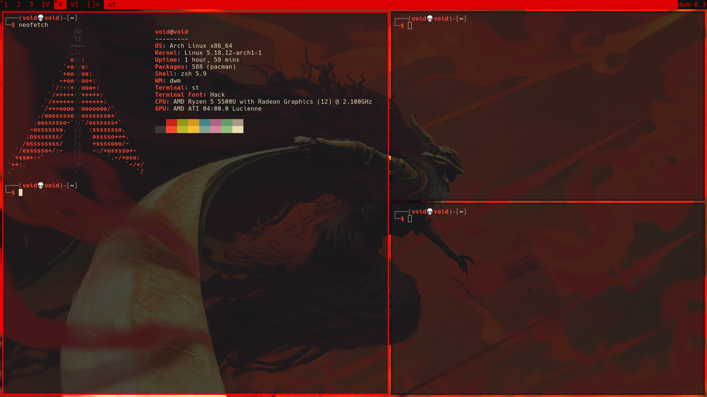

# Eldenrice manual Installation (on ArchLinux)
___


___

required packages for compilation:
```sh
pacman -S xorg-server xorg-xinit xorg-xsetroot xorg-xrandr xorg-xrdb libxinerama libxft libxcb
```
non crash patch for emojis in dwm:
```sh
yay -S libxft-bgra
```
___

```sh
mkdir ~/suckless && cd ~/suckless

git clone https://github.com/pvscvl98/dwm
git clone https://github.com/pvscvl98/dmenu
git clone https://github.com/pvscvl98/st

cd dwm && sudo make clean install && cd -
cd dmenu && sudo make clean install && cd -
cd st && sudo make clean install && cd -
```
___

fonts:
```
pacman -S tff-hack ttf-font-awesome ttf-joypixels
```
___

## patches, maintenance and updates
https://dwm.suckless.org/customisation/patches_in_git/

## [dwm](https://github.com/pvscvl98/dwm)
### patches:
+ Fn Key support:
```c
#include    <X11/XF86keysym.h>
```
+ [shiftview](https://lists.suckless.org/dev/att-7590/shiftview.c)
+ [centeredmaster](https://dwm.suckless.org/patches/centeredmaster/)
+ [uselessgap](https://dwm.suckless.org/patches/uselessgap/)
+ [fixborders](https://dwm.suckless.org/patches/alpha/)
+ [swallow](https://dwm.suckless.org/patches/swallow/)

+ todo:
    + [vanitygaps?](https://dwm.suckless.org/patches/vanitygaps/)
    + [actualfullscreen](https://dwm.suckless.org/patches/actualfullscreen/)
    + [systray](https://dwm.suckless.org/patches/systray/)
    + [dwmblocks]()

## [st](https://github.com/pvscvl98/st)
### patches:
+ [font2](https://st.suckless.org/patches/font2/)
+ [scrollback](https://st.suckless.org/patches/scrollback/)
+ [boxdraw](https://st.suckless.org/patches/boxdraw/)
+ [alpha](https://st.suckless.org/patches/alpha/)
+ [anysize](https://st.suckless.org/patches/anysize/)

+ todo:
    + patch mouse/touchpad/scratchpad scrollback

## [dmenu](https://github.com/pvscvl98/dwm)
### patches:
+ [allow color font](https://tools.suckless.org/dmenu/patches/allow-color-font/)
+ [password](https://tools.suckless.org/dmenu/patches/password/)
___

## directory structure setup
```sh
#!/bin/zsh

umask 027

mkdir -p $HOME/.vim/undodir

mkdir -p $HOME/.local/bin
mkdir -p $HOME/.local/doc/vpn
mkdir -p $HOME/.local/doc/ctf
mkdir -p $HOME/.local/img/glry
mkdir -p $HOME/.local/img/scsh

mkdir -p $HOME/.local/000/gnupg

mkdir -p $HOME/.local/src/py
mkdir -p $HOME/.local/src/c
mkdir -p $HOME/.local/src/c++
mkdir -p $HOME/.local/src/go
mkdir -p $HOME/.local/src/nim

mkdir -p $HOME/.local/src/go/bin
mkdir -p $HOME/.local/src/go/src
mkdir -p $HOME/.local/src/go/pkg

mkdir -p $HOME/code
mkdir -p $HOME/mnt

ln -sf $HOME/.local/bin $HOME/
ln -sf $HOME/.local/doc $HOME/
ln -sf $HOME/.local/doc/vpn $HOME/
ln -sf $HOME/.local/doc/ctf $HOME/
ln -sf $HOME/.local/img $HOME/

ln -sf $HOME/.local/src/py $HOME/code
ln -sf $HOME/.local/src/c $HOME/code
ln -sf $HOME/.local/src/c++ $HOME/code
ln -sf $HOME/.local/src/go $HOME/code
ln -sf $HOME/.local/src/nim $HOME/code

mkdir -p $HOME/.config/x11
cp eldenrice/x11/xinitrc $HOME/x11/xinitrc 
ln -sf $HOME/.config/x11/xinitrc $HOME/.xinitrc
```
